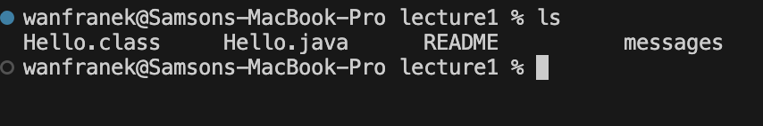
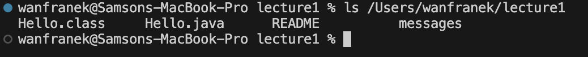
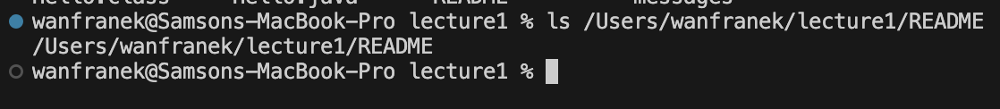

## ls
- Command Line with No Argument 
 
**Absolute path**: /Users/wanfranek/lecture1 
**Why the output**: 

- Command with a path to a directory as an argument 
 
**Absolute path**: /Users/wanfranek/lecture1 
**Why the output**: 

- Command with a path to a file as an argument 
 
**Absolute path**:
  
## cd
- Command Line with No Argument 
- Command with a path to a directory as an argument 
- Command with a path to a file as an argument 
## cat
- Command Line with No Argument 
- Command with a path to a directory as an argument 
- Command with a path to a file as an argument 
