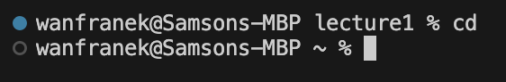
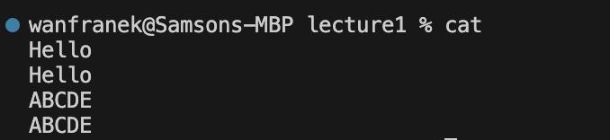
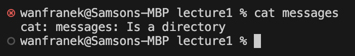
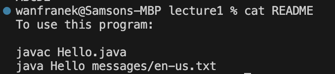

## `ls`
- Command Line with No Argument 
 
**Absolute path before**: `/Users/wanfranek/lecture1` 
**Absolute path after**: `/Users/wanfranek/lecture1` 
**Why the output**: It simply displays the content inside `lecture1` directory 
**Is it an error?**: The output is not an error because `Hello.class`, `Hello.java`, `README`, and `messages` all fall under the `lecture1` directory.

- Command with a path to a directory as an argument 
 
**Absolute path before**: `/Users/wanfranek/lecture1` 
**Absolute path after**: `/Users/wanfranek/lecture1` 
**Why the output**: The command will list the contents of the directory we passed in. We can think this functions as a "preview" of a directory, and the user will be in the same directory after executing the command.
**Is it an error?**: The output is not an error because `Hello.class`, `Hello.java`, `README`, and `messages` all fall under the `lecture1` directory.

- Command with a path to a file as an argument 
 
**Absolute path before**: `/Users/wanfranek/lecture1` 
**Absolute path after**: `/Users/wanfranek/lecture1` 
**Why the output**: `ls` shows the content of a directory, but the argument here is the path to a filename. 
**Is it an error?**: The output is not an error because when you try to `ls [filename]`, it will just repeat the name of the file or the abosulate path the user typed in that is after `ls`

  
## `cd`
- Command Line with No Argument 
 
**Absolute path before**: `/Users/wanfranek/lecture1` 
**Absolute path after**: `~/` 
**Why the output**: When no argument is given, the user will return to the home directory 
**Is it an error?**: The output is not an error because `cd ~` is the command executed when no argument is given.

  
- Command with a path to a directory as an argument 
 
**Absolute path before**: `/Users/wanfranek/lecture1` 
**Absolute path after**: `/Users/wanfranek/lecture1/messages` 
**Why the output**: It goes in to the message directory that is inside the `lecture1` folder 
**Is it an error?**: The output is not an error.

  
- Command with a path to a file as an argument 
 
**Absolute path before**: `/Users/wanfranek/lecture1` 
**Absolute path after**: `/Users/wanfranek/lecture1` 
**Why the output**: You can only `cd` into a directory but not a file 
**Is it an error?**: The ouptu is an error. The picture above shows that `cd` only suports a directory name as a argument.

  
## `cat`
- Command Line with No Argument 
 
**Absolute path before**: `/Users/wanfranek/lecture1` 
**Absolute path after**: N/A because it's in the mode of reading data from standard input adn write them to standard ouput 
**Why the output**: It basically does nothing because it just repeat what's the user typed in. The `cat` command will end when user hit control+D to indicate the end of the file 
**Is it an error?**: The output is not an error.

  
- Command with a path to a directory as an argument 
 
**Absolute path before**: `/Users/wanfranek/lecture1` 
**Absolute path after**: N/A cause error 
**Why the output**: `cat` cannot show the content of a directory, only `ls` can. 
**Is it an error?**: The output is an error because `cat` only reads the content of the file and does not accept a directory path as the argument.

  
- Command with a path to a file as an argument 
 
**Absolute path before**: `/Users/wanfranek/lecture1` 
**Absolute path after**: `/Users/wanfranek/lecture1/README` 
**Why the output**: It find the README file under the `lecture1` directory and reads its content. 
**Is it an error?**: The output is not an error.

  
