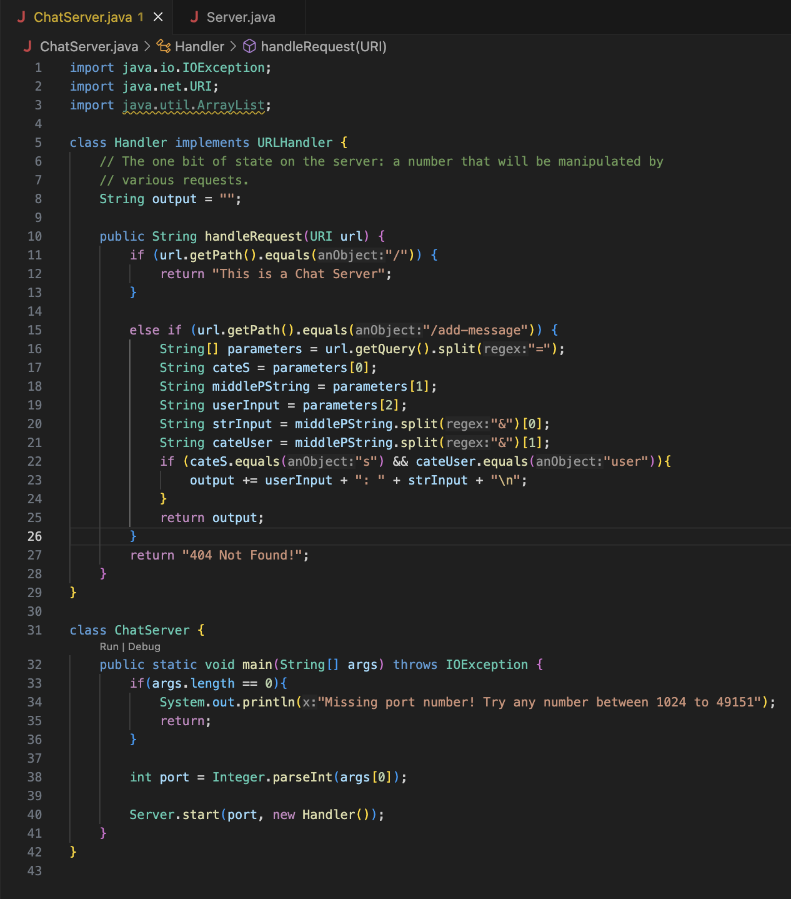
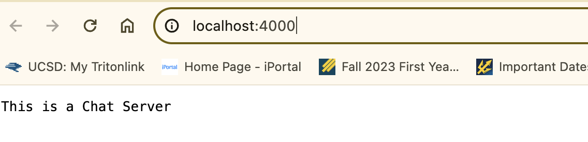
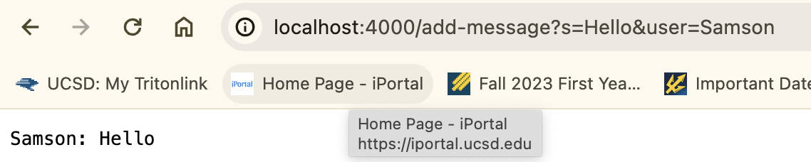
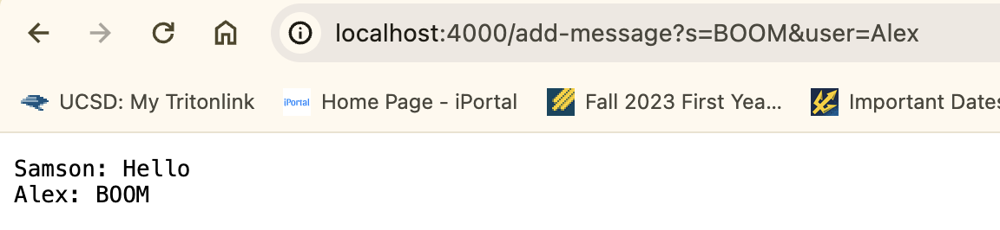
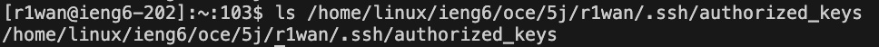
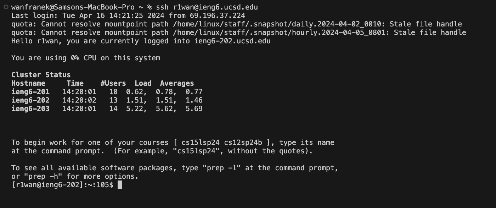

## Part 1
Code for `ChatServer` 
  

Output 1 
  

Output 2 
  
**Which methods in your code are called?** 
The handleRequest function is called everytime the page is refreshed  
**What are the relevant arguments to those methods, and the values of any relevant fields of the class?** 
For my function, the argument and field valeus are assigned to the following: 
Revelant argument: `URL url` = http://localhost:4000/add-message?s=Hello&user=Samson 
Revelant fields of the class before calling: `output = ""` 
Revelant fields of the class after calling: `output = "Samson: Hello\n"` 
Revelant fields of the method: 
`String[] parameter = ["s", "Hello&user", "Samson"]` 
`String cateS = "s"` 
`String middlePString = "Hello&user"` 
`String userInput = "Samson"` 
`String strInput = "Hello"` 
`String cateUser = "user"`  
**How do the values of any relevant fields of the class change from this specific request? If no values got changed, explain why** 
Revelant fields of the class before calling: `output = ""` 
Revelant fields of the class after calling: `output = "Samson: Hello\n"`  
Output 3 
  
**Which methods in your code are called?** 
The handleRequest function is called everytime the page is refreshed  
**What are the relevant arguments to those methods, and the values of any relevant fields of the class?** 
For my function, the argument and field valeus are assigned to the following: 
Revelant argument: `URL url` = http://localhost:4000/add-message?s=BOOM&user=Alex 
Revelant fields of the class before calling: `output = "Samson: Hello\n` 
Revelant fields of the class after calling: `output = "Samson: Hello\n"Alex: BOOM` 
Revelant fields of the method: 
`String[] parameter = ["s", "BOOM&user", "Alex"]` 
`String cateS = "s"` 
`String middlePString = "BOOM&user"` 
`String userInput = "Alex"` 
`String strInput = "BOOM"` 
`String cateUser = "user"`  
**How do the values of any relevant fields of the class change from this specific request? If no values got changed, explain why** 
Revelant fields of the class before calling: `output = "Samson: Hello\n` 
Revelant fields of the class after calling: `output = "Samson: Hello\n"Alex: BOOM`  

## Part 2
On the command line of your computer, run ls with the absolute path to the private key for your SSH key for logging into ieng6. 
  

On the command line of the ieng6 machine, run ls with the absolute path to the public key for your SSH key for logging into ieng6 (this is the one you copied to your account on ieng6 using ssh-copy-id, so it should be a path on ieng6's file system). 
  

A terminal interaction where you log into your ieng6 account without being asked for a password. 
  

## Part 3
I learned how to create public and private key that uses RSA encryption with `ssh key-gen` command. 
Another thing I learned is the `scp [file] [remote server directory]` command to make a copy of the local file in the remote server 
It's also interesting to create a web server myself and write functions that perform different actions based on the url passed in. 
For rest of the thing such as linux commandline and remote server, I have previous knowledge already. 
