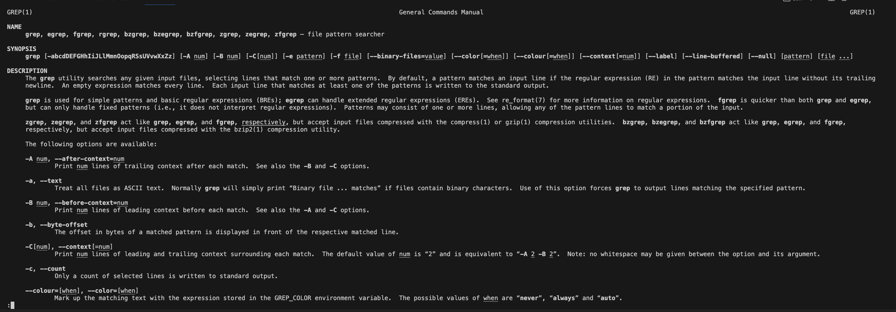

## Part 1 - Bugs
**Bug Chosen: testReverseInPlace method in the ArrayExamples.java**
1. **Failer-inducing input**
```
@Test 
public void testReverseInPlace() {
  int[] input1 = {1,2,3};
  ArrayExamples.reverseInPlace(input1);
  assertArrayEquals(new int[]{3,2,1}, input1);
}
```

2. **An input that doesn't induce a failure**
```
@Test 
public void testReverseInPlace() {
  int[] input1 = {3};
  ArrayExamples.reverseInPlace(input1);
  assertArrayEquals(new int[]{3}, input1);
}
```

3. **Symptoms**<br>
Passed Test<br>
<br><br>
Failed Test<br>
<br><br>

4. **Code**<br>
Code Before
```
static void reverseInPlace(int[] arr) {
  for(int i = 0; i < arr.length; i += 1) {
    arr[i] = arr[arr.length - i - 1];
  }
}
```

Code After
```
static void reverseInPlace(int[] arr) {
  int[] temp = new int[arr.length];
  for(int i = 0; i < arr.length; i++){
    temp[i] = arr[i];
  }
  
  for(int i = 0; i < arr.length; i += 1) {
    arr[i] = temp[arr.length - i - 1];
  }
}
```

5. **Explanation of my solution**<br>
The original code does not work because it sets `arr[i]` to `arr[arr.length-i-1]`. However the second half elements of the array value will remin unchanged after the loop ends because the first half elements of the array are no longer their original value.<br>
For example, here is a demonstration on how the wrong method works<br>
`[1,2,3,4]`<br>
`[4,2,3,4]`: `arr[0] = arr[3]`<br>
`[4,3,3,4]`: `arr[1] = arr[2]`<br>
`[4,3,3,4]`: `arr[2] = arr[1]`<br>
`[4,3,3,4]`: `arr[3] = arr[0]`<br><br>
For the fixed function, I first create a temperaory array that copies all the elements of the original array over. Therefore, when we perform the setting line of code, we will use `arr[i] = temp[arr.length - i - 1]` instead of `arr[i] = arr[arr.length - i - 1]` so that we will use the original value of each element from the temp array.<br>
For example, here is a demonstration on how the correct method works<br>
`[1,2,3,4]`<br>
`[4,2,3,4]`: `arr[0] = temp[3]`<br>
`[4,3,3,4]`: `arr[1] = temp[2]`<br>
`[4,3,2,4]`: `arr[2] = temp[1]`<br>
`[4,3,2,1]`: `arr[3] = temp[0]`<br><br>

## Part 2 - Researching Command
**Grep Command**<br>
**`grep -i`, --ignore-case: "Perform case insensitive matching.  By default, grep is case sensitive."**<br>
Example 1:<br>
```
wanfranek@Samsons-MacBook-Pro Media % grep -i "legal" AP_LawSchoolDebts.txt 
Legal education debt, which tops $84,000 for the average new
surveyed - government offices, legal aid organizations, public
```
Example 2:<br>
```
wanfranek@Samsons-MacBook-Pro Media % grep -i "law" AP_LawSchoolDebts.txt 
Law school debts forcing recruits to private sector
WASHINGTON (AP) - Most new lawyers won't consider working for
lawyer, prevents 66 percent of law students from taking public
the National Association for Law Placement and the Partnership for
"The bottom line is America's law school graduates are drowning
More than 94 percent of law students reported borrowing money to
attend law school, where median tuition is nearly $23,000 a year,
but law students are not alone in having to contend with spiraling
In the law study, about 68 percent of public interest employers
and high law school loans for discouraging law students from public
The report encourages law schools and employers to create
The median starting salary last year at private law firms, was
```
The -i option is useful beacuse sometimes the keyword we are searcing for is being capitalized as the first word of a sentence. In order to receive all the line with matching pattern, we can use -i to ensure that we do not miss anything important.<br>

**`grep -r`, --recursive: "Recursively search subdirectories listed."**<br>
Example 1:<br>
```
wanfranek@Samsons-MacBook-Pro technical % grep -r "base pair" plos
plos/journal.pbio.0020223.txt:        Watson-Crick base pairing, the proximity of the synthetic reactive groups elevates their
plos/journal.pbio.0020190.txt:        sequence, which is a specific series of eight base pairs in the DNA of the bacterial
plos/journal.pbio.0020190.txt:        chromosomes, on the order of one or two thousand base pairs of DNA (or less—their length i
```
Example 2:<br>
```
wanfranek@Samsons-MacBook-Pro technical % grep -r "post-translational modification" biomed
biomed/1471-2121-3-12.txt:        post-translational modifications may play a role in
biomed/ar422.txt:          Analysis of post-translational modifications in
biomed/1471-2164-4-19.txt:        post-translational modification. In ChIP, whole cells are
biomed/1471-2202-3-3.txt:          post-translational modification of the translational
biomed/1475-4924-1-10.txt:            accumulated following post-translational modification.
biomed/1476-511X-1-2.txt:        transcription factors, post-translational modifications,
biomed/1471-2091-2-7.txt:        post-translational modification of regulatory proteins by
biomed/gb-2003-4-3-r18.txt:        post-translational modification in addition to
biomed/1471-2164-3-26.txt:          post-translational modification sites and nuclear
biomed/gb-2001-3-1-research0001.txt:        post-translational modification, permeability properties
biomed/1472-6793-2-5.txt:        demonstrate that there is a post-translational modification
biomed/1472-6793-2-5.txt:          post-translational modification on wild-type pR is
biomed/1472-6793-2-5.txt:          post-translational modification of unknown nature.
biomed/1472-6793-2-5.txt:        post-translational modifications, including ~4000 daltons
biomed/1472-6793-2-5.txt:        post-translational modifications might also play a role in
biomed/1471-2407-1-15.txt:        NMT-4, a post-translational modification, such as
biomed/1475-2867-2-15.txt:        post-translational modification of nuclear hormone
```
The default grep command is intended to use on a file and search an specific pattern within that file. However, if we want to search the pattern for every file under the directory, we have to perform this command for (number of files) times. With the -r recursive search commnad line option, the terminal can automatically loop through each file within the given directory based on he given pattern and list everything out as one output.<br>

**`grep -o`, --only-matching: "Prints only the matching part of the lines."**<br>
Example 1:<br>
```
wanfranek@Samsons-MacBook-Pro About_LSC % grep -o "System" reporting_system.txt 
System
System
System
System
System
System
System
System
```
Example 2:<br>
```
wanfranek@Samsons-MacBook-Pro About_LSC % grep -o "programs" reporting_system.txt
programs
programs
programs
programs
programs
programs
programs
programs
programs
programs
programs
programs
programs
programs
programs
programs
programs
programs
programs
```

The -o command option is useful because it displays the matching part of the file in a very clear manner and the terminal result will become way more neater. As a result, the user can easily know how many times the pattern appears. The bad thing is we won't be able to know the sentence/context the keywrod belongs to.<br>

**`grep -l`, --files-with-matches: "Only the names of files containing selected lines are written to standard output."**<br>
Example 1:<br>
```
wanfranek@Samsons-MacBook-Pro government % grep -rl "height" Media
Media/The_State_of_Pro_Bono.txt
Media/Farm_workers.txt
```
Example 2:<br>
```
Media/Farm_workers.txt
wanfranek@Samsons-MacBook-Pro government % grep -rl "nothing" Media
Media/Legal_system_fails_poor.txt
Media/Higher_Registration_Fees.txt
Media/Making_a_case.txt
Media/Farm_workers.txt
Media/Greedy_Generous.txt
Media/Retirement_Has_Its_Appeal.txt
```

The -l command line option is really useful because it will display the **unique** files that contain the keyword under the targed directory. Even though some file has the keyword appearing multiple times, it will onyl be displayed once.<br>

**Source**<br>
I managed to find these 4 intersting command line options of `grep` by using `man grep` in the terminal.<br>
Here is a screenshot of what I recieved after inputting the command into the terminal:<br>



