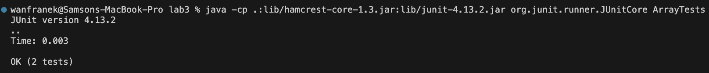
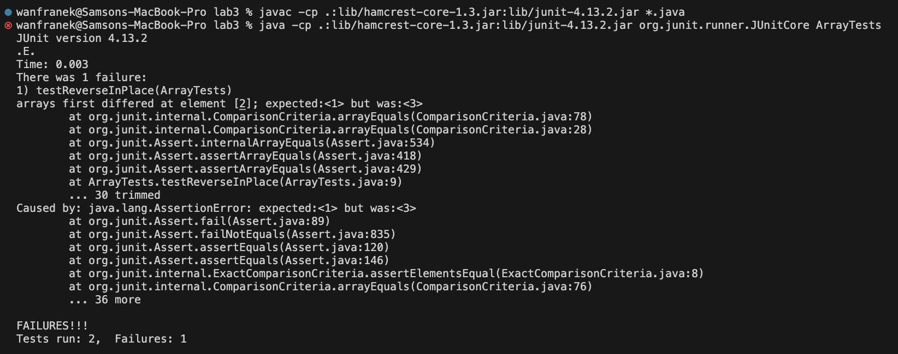

## Part 1
**Bug Chosen: testReverseInPlace method in the ArrayExamples.java**
1. **Failer-inducing input**
```
@Test 
public void testReverseInPlace() {
  int[] input1 = {1,2,3};
  ArrayExamples.reverseInPlace(input1);
  assertArrayEquals(new int[]{3,2,1}, input1);
}
```

2. **An input that doesn't indue a failure**
```
@Test 
public void testReverseInPlace() {
  int[] input1 = {3};
  ArrayExamples.reverseInPlace(input1);
  assertArrayEquals(new int[]{3}, input1);
}
```

3. **Symptoms**<br>
Passed Test<br>
<br><br>

Failed Test<br>
<br><br>
