## Lab Report 4 - Vim
**Step 4** 
`ssh<space>r1wan@ieng6.ucsd.edu<enter>` to gain access to the SSH remote server 
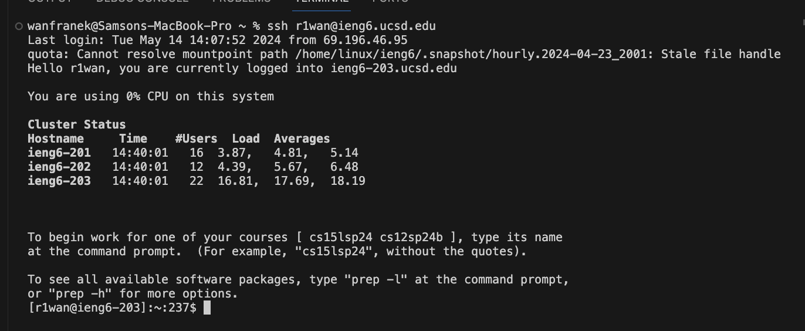  

**Step 5** 
`git<space>clone<space>git@github.com:lukkrim/lab7.git<enter>` to clone the github repo using SSH key 
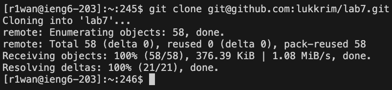  

**Step 6** 
`ls<enter>` to display the content of the home directory  
`cd<space>lab7<enter>` to go into the lab7 directory 
`ls<enter>` to diasplay the content of the lab7 directory 
`bash<space>test.sh<enter>` to run the bash file with junit test 
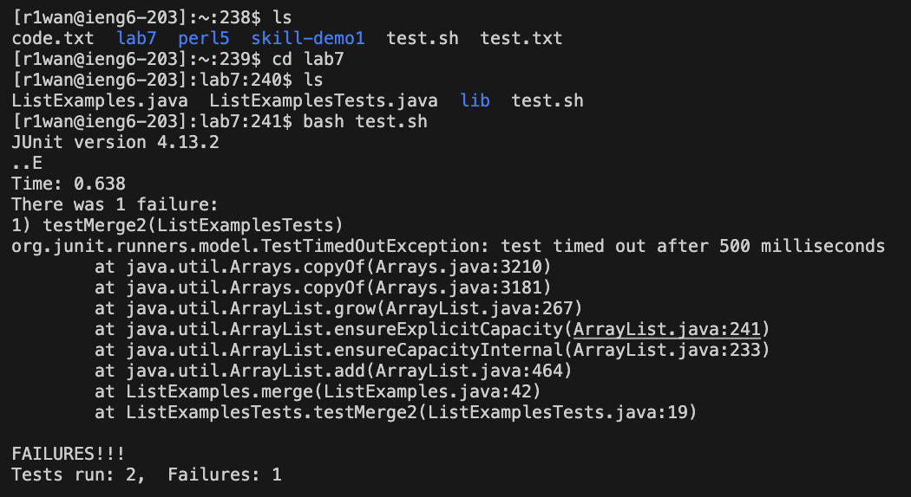  

**Step 7** 
`ls<enter>` to display the content of the lab 7 directory 
`vim<space>ListExamples.java<enter>` to edit `ListExamples.java` with Vim text editor 
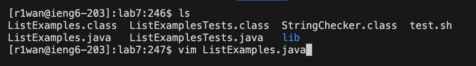 
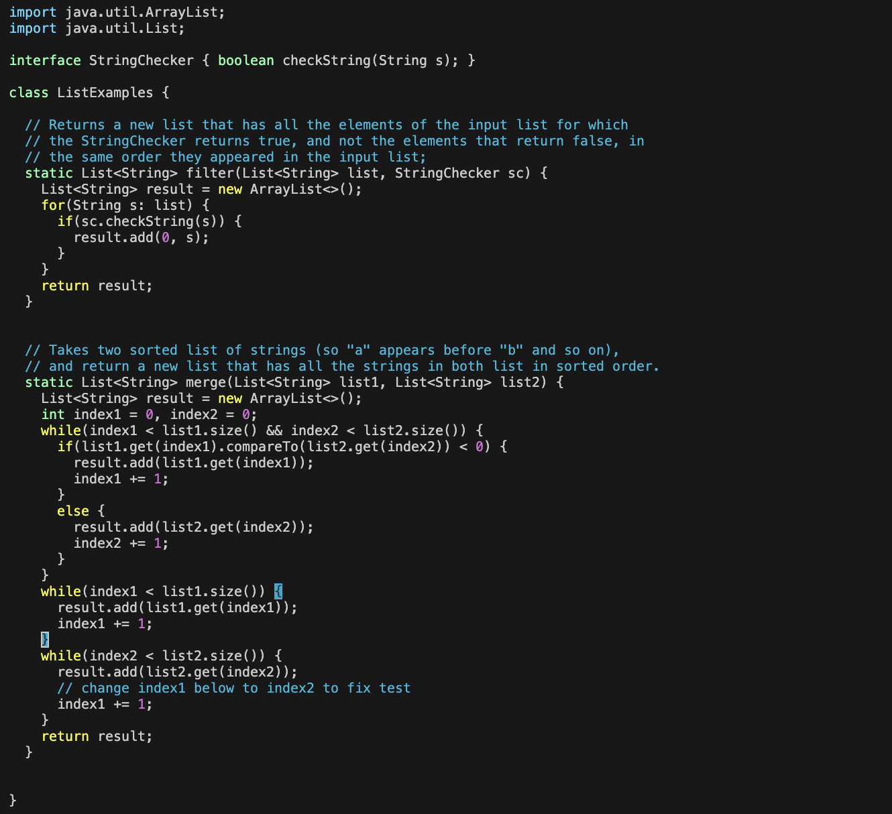  

`?index1<enter>` to search for the location of the error 
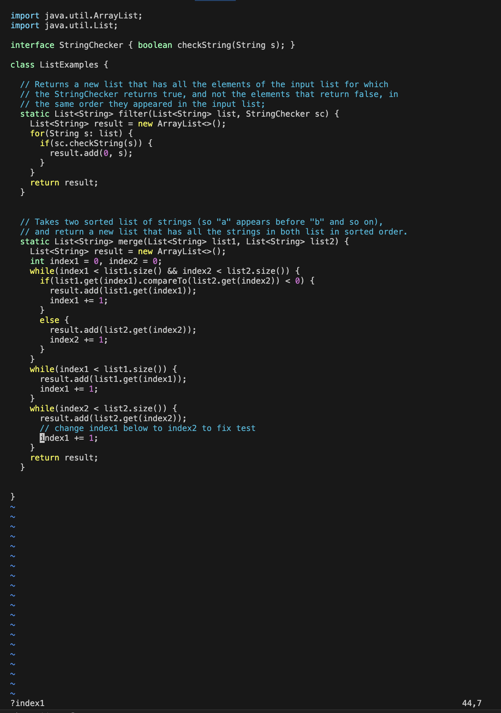  

`<right><right><right><right><right>` to toggle the cursor on to the number 1 
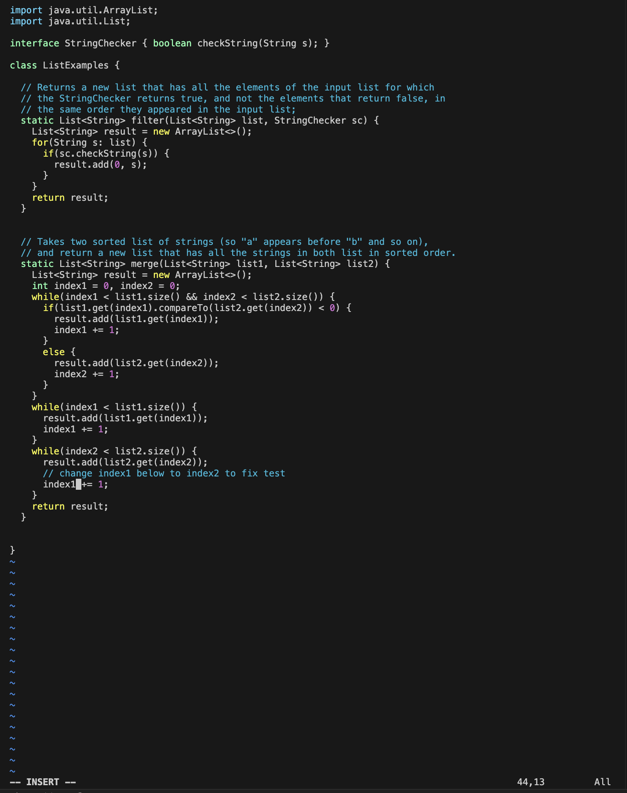  

`x` to delete 1 
`i` to enter into insert mode 
`2` to enter the new value 2 
`esc` to exit the insert mode 
`:wq<enter>` to save and quit 
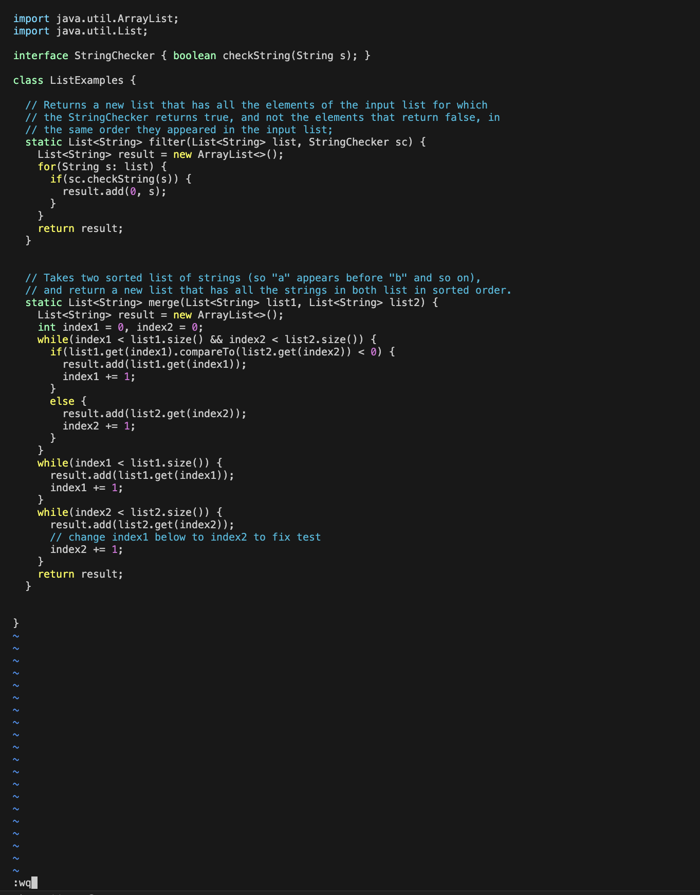  

`clear<enter>` to clear the terminal 
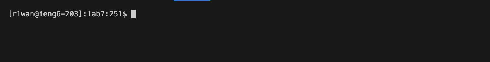  

**Step 8** 
`ls<enter>` to show the content of the home directory 
`bash<space>test.sh<enter>` to run the bash script 
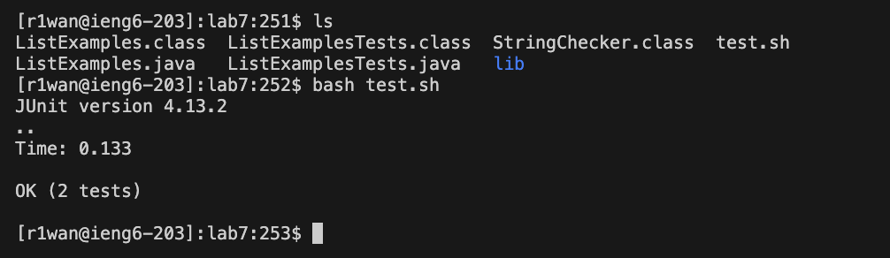  

**Step 9** 
`git<space>add<space>.` to adds all modified and new files(including all subdirectoeries) in the current directory to the staging area 
`git<space>commit<space>-m<space>"ListExample.java Fixed"` to commit all files in the staging area with commit message "ListExample.java Fixed" 
`git<space>push` to push all the commited files to the origin main on github
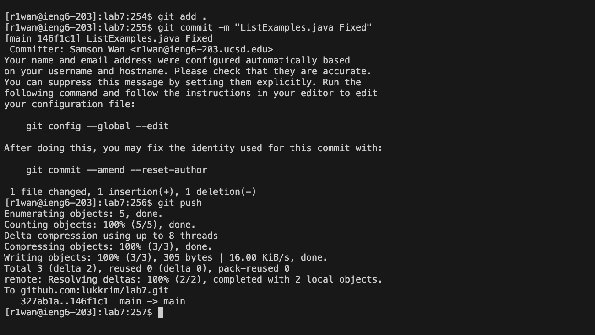  
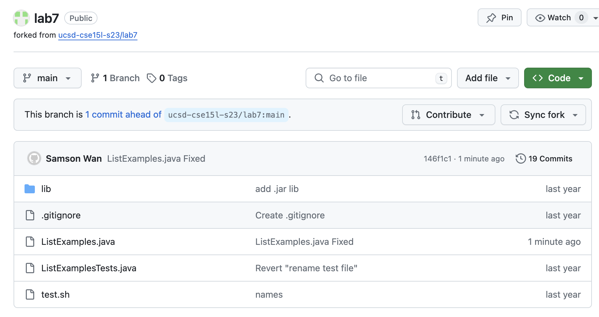  
