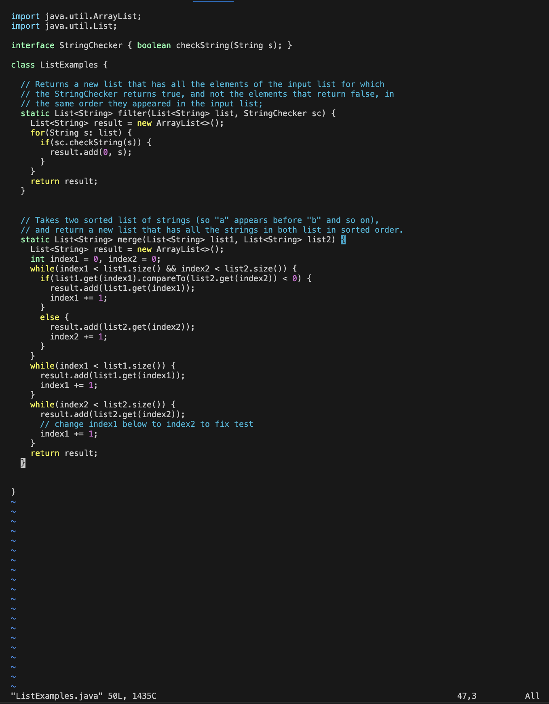

## Lab Report 4 - Vim
**Step 4** 
`ssh<space>r1wan@ieng6.ucsd.edu<enter>` 
  

**Step 5** 
`git<space>clone<space>git@github.com:lukkrim/lab7.git<enter>` 
  

**Step 6** 
`ls` 
`cd<space>lab7` 
`ls` 
`bash<space>test.sh` 
  

**Step 7** 
`ls` 
`vim<space>ListExamples.java` 
 
  

`?index1<enter>` to search for the location of the error 
  

`<right><right><right><right><right>` to toggle the cursor on to the number 1 
  

`x` to delete 1 
`i` to enter into insert mode 
`2` to enter the new value 2 
`esc` to exit the insert mode 
`:wq<enter>` to save and quit 
  

Mouse click
**Step 8** 
**Step 9** 

