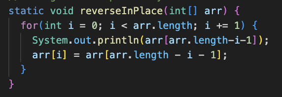
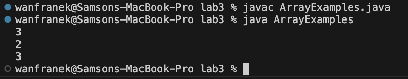
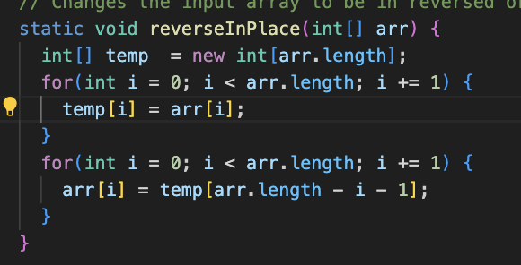

## Lab5 - Putting it all together
**Part 1** 
Question: ArrayExamples Test Failed 
Student:  
I have two files `ArrayExamples.java` and `ArrayTests.java` under the `lab3` directory 
When I run the Junit test with `javac -cp .:lib/hamcrest-core-1.3.jar:lib/junit-4.13.2.jar *.java` and `java -cp .:lib/hamcrest-core-1.3.jar:lib/junit-4.13.2.jar org.junit.runner.JUnitCore ArrayTests` command  

My Method seems right but one of the two tests failed. Can I have a hint on where is wrong?  
Here is the sympotom my bug: "arrays first differed at element [2]; expected:<1> but was:<3>"  
Is this beacuse the element at index 2 got assigned to the wrong value somehow? 
  

Instructor:  
Yes, you might want to check the process when u reverse the array 
Maybe try to print out the new value the array element got assigned to in your iteration.

Student: 
I added a print statement in my loop and debug it by writing a main method in ArrayExamples.java 
  
I noticed that the element at index 2 got assigned to 3 again 
  

Instructor:  
What if your array has changed while you are assigning these values? 

Student:  
Oh, I see. The last element got assigned to the first element with the value after the update. 
So what I need to do is to create a temporary array to store all the elements of the old array and set the values. 
Here is a update version of my code and they seems to be working. Thank you for the help!
  

**Part 2** 
Reflection: 
For the second half of the qurater, I learned a lot more new things. Even though I am familiar with test editors such as vim and nano, I still manged to learn many new command line shortcut of vim such as searching for elements from the end of teh file. The jdb debugger is completetly new to me ad I learned how to stop at certain line and capture the intedned error through viewing local varible values. It's a really fun experience learning in CSE 15L this quarter and I enjoy doing the lab and taking the skill demo.
