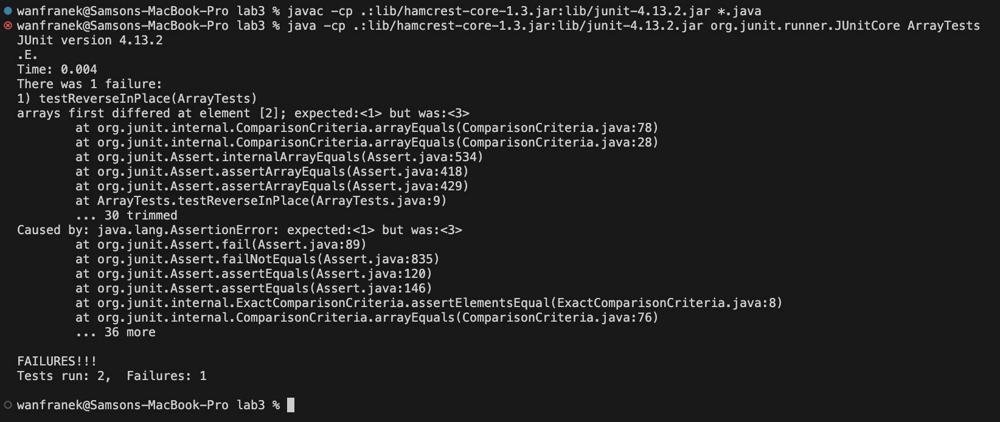

## Lab5 - Putting it all together
**Part 1** 
Question: ArrayExamples Test Failed 
Student:  
My Method seems right but one of the two tests failed. Can I have a hint on where is wrong?  
Here is the sympotom my bug: "arrays first differed at element [2]; expected:<1> but was:<3>"  
  

Instructor: 
